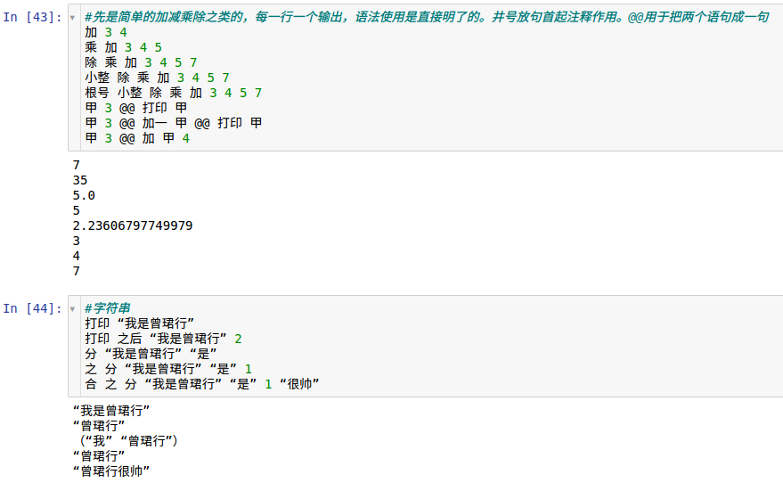
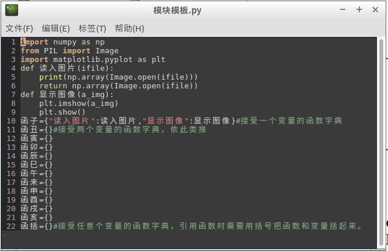

# 自然派语法汇总
# 更新2024.03.17
更新了自然派，还是只需要下载dist就可以通过：python dist/自然派 来运行自然派了。将注释改成%符号，因为感觉#又作注释又作为类的表示比较容易混，而且之后可能增加行内注释。增加了 英符 函数，可以通过 英符 “你好” 返回你好，这样便于处理字符串，删除了 数 函数，和 数之 有点重复。更新了一个 自然派用法.jsonl 文件，用问答的形式将自然派函数都说了一遍，这下会编程的人看完这个应该就可以学会自然派了。我把内容贴到基本语法上面了。
# 更新2023.12.20
更新了协议。更新了dist文件夹，现在不是编译而是加密，所以只需要下载dist就可以通过：python dist/自然派 来运行自然派了，应该所有的python3都可以运行，而不需要下载之前那一堆依赖了。还加了点函数，之后有空再说，主要是为了和派对(https://github.com/Amo-Zeng/paidui )一起发布。
# 自然派介绍：
自然派是一种中文编程语言。它类似于Lisp，但是没有烦多的括号。（ziranpai is a Chinese programming language, which is similar to Lisp but without the cumbersome brackets.）
具体的前世今生参见（http://114.67.237.166/ziranpai.html ）
这个页面包括了一个二进制语言解释器和一些模块和代码。README.md是用jupyter notebook编写的。因为我设置了bash找不到命令时用调用 自然派 来运行。因此下面的代码是直接在bash终端可以运行的。读者可以使用 “./自然派 命令” 或 “自然派 代码文件” 或者直接 “./自然派” 来运行程序。

使用方法：

1.可以用github的codespace打开这个项目，然后 export PATH=/workspaces/ziranpai/Python-3.7.2/bin:$PATH 应该就可以用 “./自然派” 运行了。

2.下载到自己电脑，安装python3.7.2环境应该就可以了。

# 内置函数包括：
接一参数：["查看类变量","删除变量","系统命令","显示目录","转到目录","创建目录","是否文件","是否目录","组","大整","小整","绝对值","第一个","第一列","是否","长度","组否","数否","最大值","最小值","否","空否","数字否","程序否","字符否","引用","打印","求值","片","加一","符之","数之","英符","手动输入","去空","正弦","余弦","根号","指数"]

接两参数：["复制类变量","范","重命名","保存","读取","追加","加","或","且","合","分","位","减","乘","除","模","大于","小于","大于等于","等于","等否","令","设","通令","通设","在","附加","精度","函","超函","超超函","之","之后","之前","自加","自乘","组加","次方"]

接三参数：["画图","行读","若","替","直到","循","组循","之间"]

接四参数：["行读退","循退","组循跳"]

接多参数：["超合","映射","打印"]

# 自然派用法

```
{"Q":"自然派编程语言中如何使用查看类变量函数?","A":"人#姓名 张三 @@ 查看类变量 人"}
{"Q":"自然派编程语言中如何使用删除变量函数?","A":"甲 3 @@ 删除变量 甲 @@ 甲"} 
{"Q":"自然派编程语言中如何使用系统命令函数?","A":"系统命令 ls"}
{"Q":"自然派编程语言中如何使用显示目录函数?","A":"显示目录 ."}
{"Q":"自然派编程语言中如何使用转到目录函数?","A":"转到目录 /home/user"}
{"Q":"自然派编程语言中如何使用创建目录函数?","A":"创建目录 新目录"}
{"Q":"自然派编程语言中如何使用是否文件函数?","A":"是否文件 readme.txt"}
{"Q":"自然派编程语言中如何使用是否目录函数?","A":"是否目录 Documents"}
{"Q":"自然派编程语言中如何使用保存输入函数保存历史输入命令?","A":"保存输入 历史输入"}
{"Q":"自然派编程语言中如何使用获取输入函数获取历史输入命令?","A":"获取输入 历史输入"}
{"Q":"自然派编程语言中如何使用组函数创建数组?","A":"组 5"}
{"Q":"自然派编程语言中如何使用大整函数?","A":"大整 3.14"}
{"Q":"自然派编程语言中如何使用小整函数?","A":"小整 3.9"}
{"Q":"自然派编程语言中如何使用绝对值函数?","A":"绝对值 -5"}
{"Q":"自然派编程语言中如何使用第一个函数获取字符串首字符?","A":"第一个 “Hello World”"}
{"Q":"自然派编程语言中如何使用第一列函数获取矩阵首列?","A":"第一列（组之（组之 1 2）（组之 3 4））"}
{"Q":"自然派编程语言中如何使用是否函数?","A":"是否 真"}
{"Q":"自然派编程语言中如何使用长度函数获取字符串长度?","A":"长度 自然派不错"}
{"Q":"自然派编程语言中如何使用组否函数判断对象是否为数组?","A":"组否（组之 1 2 3）"}
{"Q":"自然派编程语言中如何使用数否函数判断是否为数字?","A":"数否 3.14"}
{"Q":"自然派编程语言中如何使用最大值函数获取数组最大元素?","A":"最大值（组之 3 5 2）"}
{"Q":"自然派编程语言中如何使用最小值函数获取数组最小元素?","A":"最小值（组之 6 2 9）"}
{"Q":"自然派编程语言中如何使用否函数取反?","A":"否 真"}
{"Q":"自然派编程语言中如何使用空否函数判断对象是否为空?","A":"空否（组之 1 2）"}
{"Q":"自然派编程语言中如何使用数字否函数判断是否为数字?","A":"数字否 123"}
{"Q":"自然派编程语言中如何使用程序否函数判断是否为函数?","A":"程序否 （打印）"}
{"Q":"自然派编程语言中如何使用字符否函数判断是否为字符?","A":"字符否 a"}
{"Q":"自然派编程语言中如何使用引用函数将自定义在其他文件的自然函数引用到本环境中?","A":"引用 内置函数"}
{"Q":"自然派编程语言中如何使用打印函数打印输出?","A":"打印 “Hello World!”"}
{"Q":"自然派编程语言中如何使用求值函数计算表达式值?","A":"求值 加 2 3"}
{"Q":"自然派编程语言中如何使用加一函数使变量的值加一?","A":"加一 甲"}
{"Q":"自然派编程语言中如何使用片函数将代码片段赋给另一个变量?","A":"令 甲加一 片 加一 甲@@令 甲 4 甲加一 打印 甲"}
{"Q":"自然派编程语言中如何使用符之函数将数字转为字符串?","A":"符之 123"}
{"Q":"自然派编程语言中如何使用英符函数将中文格式字符串转为英文格式字符串?","A":"英符 “hello world”"}
{"Q":"自然派编程语言中如何使用数之函数将字符串转为数字（包括变量）?","A":"数之 “3.14”"}
{"Q":"自然派编程语言中如何使用手动输入函数接收用户输入?","A":"令 乙 手动输入 请输入一个数字 打印 乙"}
{"Q":"自然派编程语言中如何使用去空函数去除字符串前后空格?","A":"去空 “  Hello   ”"}
{"Q":"自然派编程语言中如何使用正弦函数计算正弦值?","A":"正弦 0.5"}
{"Q":"自然派编程语言中如何使用余弦函数计算余弦值?","A":"余弦 1"}
{"Q":"自然派编程语言中如何使用根号函数计算平方根?","A":"根号 25"}
{"Q":"自然派编程语言中如何使用指数函数计算e的幂?","A":"指数 3"}
{"Q":"自然派编程语言中如何使用复制类变量函数?","A":"人#姓名 李四 @@ 复制类变量 人 我 @@ 打印 我#姓名"}
{"Q":"自然派编程语言中如何使用范函数获取范围数组?","A":"范 3 8"}
{"Q":"自然派编程语言中如何使用重命名函数重命名文件?","A":"重命名 老文件.txt 新文件.txt"}
{"Q":"自然派编程语言中如何使用保存函数保存文件内容?","A":"保存 “文件内容” 文件名.txt"}
{"Q":"自然派编程语言中如何使用读取函数读取文件内容到变量?","A":"读取 文件名.txt 甲"}
{"Q":"自然派编程语言中如何使用追加函数向文件追加内容?","A":"追加 文件名.txt 新内容"}
{"Q":"自然派编程语言中如何使用加函数进行加法运算?","A":"加 3 5"}
{"Q":"自然派编程语言中如何使用加函数进行加法运算?","A":"+ 3 5"}
{"Q":"自然派编程语言中如何使用或函数进行逻辑或运算?","A":"或 真 假"}
{"Q":"自然派编程语言中如何使用且函数进行逻辑与运算?","A":"且 真 真"}
{"Q":"自然派编程语言中如何使用合函数连接字符串?","A":"合 Hello World"}
{"Q":"自然派编程语言中如何使用合函数连接字符串?","A":"合 “Hello” “World”"}
{"Q":"自然派编程语言中如何使用分函数分割字符串?","A":"分 “Hello World” “ ”"}
{"Q":"自然派编程语言中如何使用位函数获取字符串的位值?","A":"位 你好吗 好"}
{"Q":"自然派编程语言中如何使用减函数进行减法运算?","A":"减 8 3"}  
{"Q":"自然派编程语言中如何使用减函数进行减法运算?","A":"- 8 3"}  
{"Q":"自然派编程语言中如何使用乘函数进行乘法运算?","A":"乘 4 5"}
{"Q":"自然派编程语言中如何使用乘函数进行乘法运算?","A":"* 4 5"}
{"Q":"自然派编程语言中如何使用乘函数进行乘法运算?","A":"× 4 5"}
{"Q":"自然派编程语言中如何使用除函数进行除法运算?","A":"除 20 4"}
{"Q":"自然派编程语言中如何使用除函数进行除法运算?","A":"/ 20 4"}
{"Q":"自然派编程语言中如何使用模函数计算余数?","A":"模 17 3"}
{"Q":"自然派编程语言中如何使用大于函数进行大于比较?","A":"大于 7 5"}
{"Q":"自然派编程语言中如何使用小于函数进行小于比较?","A":"小于 2 6"}
{"Q":"自然派编程语言中如何使用大于等于函数进行大于等于比较?","A":"大于等于 6 6"}
{"Q":"自然派编程语言中如何使用大于等于函数进行小于等于比较?","A":"小于等于 9 6"}
{"Q":"自然派编程语言中如何使用等于函数进行等于比较?","A":"等于 3 3"}
{"Q":"自然派编程语言中如何使用等否函数进行不等比较?","A":"等否 Hello World"}
{"Q":"自然派编程语言中如何使用令函数对变量赋值?","A":"令 甲 5"}
{"Q":"自然派编程语言中如何使用设函数为储存在变量名中的变量赋值?","A":"令 第一个人 甲 设 第一个人 张三 打印 甲"}
{"Q":"自然派编程语言中如何在函数中使用通令函数定义最外层的变量（类似全局变量）?","A":"张三高 1.7@@增高 通令 张三高 加 张三高 数甲@@增高 0.2 打印 张三高"}
{"Q":"自然派编程语言中如何在函数中使用通设函数定义最外层的变量（类似全局变量）?","A":"冠军 李四 @@冠军得奖 通设 （超合 冠军 # 获得） 合 合 获奖 数甲 万元@@ 冠军得奖 20 打印 李四#获得"}
{"Q":"自然派编程语言中如何使用在函数检查子串是否在字符串中?","A":"在 “World” “Hello World”"}
{"Q":"自然派编程语言中如何使用附加函数返回向数组添加元素后的数组?","A":"附加（组之 1 2 3）4"}
{"Q":"自然派编程语言中如何使用精度函数设置数字精度?","A":"精度 3.14159 2"}
{"Q":"自然派编程语言中如何简单的方法定义新函数?","A":"大 若 大于 数甲 数乙 数甲 数乙 @@ 大 3 5"}
{"Q":"自然派编程语言中如何使用函函数定义新函数?","A":"令 大 函 （数一 数二）（若 大于 数一 数二 数一 数二）@@ 大 3 5"}
{"Q":"自然派编程语言中如何使用超函函数来定义可以传递代码块的函数?","A":"令 循次 超函 （操作 次数）（开始 操作 若 等于 次数 1 无 （循次 操作 减 次数 1））@@循次 打印 甲 3"}
{"Q":"自然派编程语言中如何使用简单的方法来定义可以传递代码块的函数?","A":"循次 运甲 若 等于 运乙 1 无 循次 运甲 减 运乙 1@@循次 打印 甲 3"}
{"Q":"自然派编程语言中如何使用简单的方法来定义可以同时传递变量和代码块的函数?","A":"循次 运甲 若 等于 数甲 1 无 循次 减 数甲 1 运甲@@循次 3 打印 甲"}
{"Q":"自然派编程语言中如何使用简单的方法来定义可以同时传递变量和代码块的函数?","A":"比运 若 大于 数甲 数乙 运甲 运乙 @@ 比运 3 5 打印 甲 打印 乙"}
{"Q":"自然派编程语言中如何使用之函数访问数组元素?","A":"之（组之 1 2 3）1"}
{"Q":"自然派编程语言中如何使用之前函数访问数组某个位置之前的元素?","A":"之前（组之 1 2 3）1"}
{"Q":"自然派编程语言中如何使用之后函数访问数组某个位置及之后的元素?","A":"之后（组之 1 2 3）1"}
{"Q":"自然派编程语言中如何使用之后函数截取字符串后部分?","A":"之后 Hello 2"}
{"Q":"自然派编程语言中如何使用之前函数截取字符串前部分?","A":"之前 “Hello” 3"}
{"Q":"自然派编程语言中如何使用自加函数对变量自增?","A":"甲 3 @@ 自加 甲 3"}
{"Q":"自然派编程语言中如何使用自乘函数对变量自乘?","A":"甲 3 @@ 自乘 甲 3@@打印甲"}
{"Q":"自然派编程语言中如何使用组加函数使数组本身增加一个元素?","A":"令 甲 （组之 1 3 4） 组加 甲 5 打印 甲"}
{"Q":"自然派编程语言中如何使用附加函数返回数组增加一个元素后的数组?","A":"附加（组之 1 2 3）4"}
{"Q":"自然派中什么时候要用@@，什么时候可以不用","A":"自然派按行按顺序执行命令，一行中有多条语句按顺序执行不用加。但是自然派中简单的定义函数的方法是 函数名 语句，它会把函数名之后的语句都当作函数要执行的语句，因此在一行中定义函数并调用函数需要加@@把语句分割成多条语句来执行。"}
{"Q":"自然派编程语言中如何使用次方函数计算幂运算?","A":"次方 2 3"}
{"Q":"自然派编程语言中如何使用当函数实现满足条件时的循环?","A":"令 甲 1 当 小于 甲 6 【打印 甲 加一 甲】"}
{"Q":"自然派编程语言中如何使用画图函数进行图形绘制?","A":"画图（函数）自变量下限 自变量上限"}
{"Q":"自然派编程语言中如何使用行读函数按行读取文件并打印出每一行?","A":"行读 文件.txt 行 打印 行"}
{"Q":"自然派编程语言中如何使用若函数进行条件判断?","A":"若 真 打印 真 打印 假"}
{"Q":"自然派编程语言中如何使用替函数替换字符串中的子串?","A":"替 “Hello World” “l” “L”"}
{"Q":"自然派编程语言中如何使用直到函数实现循环直到条件满足?","A":"令 甲 0 直到 大于 甲 5 【打印 甲 加一 甲】打印 完成"}
{"Q":"自然派编程语言中如何使用循函数进行循环遍历?","A":"循 组 5 甲 打印 甲"}
{"Q":"自然派编程语言中如何使用组循函数生成一个新数组?","A":"组循 组 5 甲 乘 甲 2"}
{"Q":"自然派编程语言中如何使用之间函数获取字符串子串?","A":"之间 你好，世界 0 2"}
{"Q":"自然派编程语言中如何使用更新数组函数更新数组中第二位的值到4?","A":"更新数组 数组 1 4"}
{"Q":"自然派编程语言中如何使用行读退函数按条件读取文件内容?","A":"行读退 文件.txt 行 打印 行 退出打印条件"}
{"Q":"自然派编程语言中如何使用循退函数按条件遍历数组?","A":"循退 组 5 甲 打印 甲 退出打印条件"}
{"Q":"自然派编程语言中如何使用组循跳函数根据条件生成新数组（满足条件则跳过该元素）?","A":"组循跳 组 5 甲 乘 甲 2 等于 甲 0"}
{"Q":"自然派编程语言中如何使用直到跳函数根据条件执行命令（满足条件则跳过该操作）?","A":"令 甲 0 直到跳 大于 甲 10 【加一 甲】等于 模 甲 2 1 打印 甲"}
{"Q":"自然派编程语言中如何使用超合函数连接多个字符串?","A":"（超合 甲 乙 丙）"}
{"Q":"自然派编程语言中如何使用打印函数打印多个参数?","A":"（打印 第一个 第二个 第三个 第四个）"}
{"Q":"自然派编程语言中如何使用映射函数对数组元素进行映射?","A":"乘2 乘 数甲 2@@ （映射 （乘2）（组之 1 2 3））"}
{"Q":"自然派编程语言中如何使用映射函数对数组元素进行映射?","A":"（映射 （加）（组之 1 2 3） （组之 4 2 9））"}
{"Q":"自然派编程语言中如何使用映射函数对数组元素进行映射?","A":"偶否 若 模 数甲 2 假 真@@（映射 （偶否）（组之 1 2 3））"}
{"Q":"自然派编程语言中如何使用开始函数将多条语句合成一个参数?","A":"（开始 打印 甲 打印 乙）"}
{"Q":"自然派编程语言中如何使用【】将多条语句合成一个参数?","A":"【 打印 甲 打印 乙】"}
{"Q":"自然派中如何返回一个英文的空字符串？","A":"空符"}
{"Q":"自然派中如何返回一个空格？","A":"空格"}
{"Q":"自然派中如何返回一个空数组？","A":"空组"}
{"Q":"自然派中如何返回一个空字典？","A":"空典"}
{"Q":"自然派中如何返回一个真值？","A":"真"}
{"Q":"自然派中如何返回一个假值？","A":"假"}
{"Q":"自然派中如何返回一个无需要操作的语句？","A":"无"}
{"Q":"自然派中如何返回一个随机数？","A":"随机数"}
{"Q":"自然派中如何返回一个当前目录的内容？","A":"当前目录"}
{"Q":"自然派中如何返回一个当前路径的绝对路径？","A":"当前路径"}
{"Q":"自然派中如何清空所有新定义的变量？","A":"重置"}
{"Q":"什么是自然派语言?","A":"自然派是一种中文编程语言,语法类似于Lisp,但去掉了很多冗余的括号,使代码更接近自然语言的表达方式。"}
{"Q":"自然派程序的基本结构是什么?","A":"自然派程序由一行行语句构成,每行语句都是一个函数调用的形式,由函数名和参数组成,语句会按顺序依次执行。"}
{"Q":"自然派有哪些基本的数据类型?","A":"自然派的基本数据类型包括整数、浮点数和字符串。数字直接写出,字符串需用双引号括起。"}
{"Q":"如何在自然派中进行基本的数学运算?","A":"自然派内置了加、减、乘、除等数学函数,如:加 3 5 会计算3+5的结果。"} 
{"Q":"自然派中如何定义和使用变量?","A":"使用令语句对变量进行赋值,如:令 甲 3。之后可直接使用该变量名。"}
{"Q":"自然派中如何实现条件判断?","A":"使用若函数,语法为:若 条件 真执行 假执行。条件部分由比较运算符如大于、小于等构成。"}
{"Q":"如何在自然派中使用循环结构?","A":"使用循函数,语法为:循 组 循环次数 临时变量 循环体语句。临时变量会遍历0到循环次数-1的值。"}
{"Q":"自然派中如何定义函数?","A":"函数定义语法为:函数名 函数体语句。函数体中数甲、数乙等代表第1、2个参数,如:加法 加 数甲 数乙"} 
{"Q":"自然派的函数能否嵌套调用?","A":"可以,自然派函数可直接嵌套作为参数传递给其他函数,从而实现复杂逻辑。"}
{"Q":"如何在自然派中对数组进行遍历?","A":"使用循组合循函数,如:遍历 循 组 长度 数甲 元 打印 元"}
{"Q":"如何在自然派中使用递归?","A":"直接在函数体中调用该函数名即可实现递归,如:阶乘 若 等于 数甲 1 1 乘 数甲 阶乘 减 数甲 1"}
{"Q":"如何用自然派定义一个将两个数相加的函数?","A":"加法 加 数甲 数乙"}
{"Q":"如何用自然派定义一个将三个数字求和的函数?","A":"三求和 加 加 数甲 数乙 数丙"}
{"Q":"如何用自然派定义一个计算一个数的阶乘的函数?","A":"阶乘 令 结果 1 循 组 数甲 甲 自乘 结果 加 甲 1 打印 结果"}
{"Q": "如何使用自然派语言打印你好五次？", "A": "循 组 5 甲 打印 你好"}
{"Q": "我想使用自然派语言打印你好七次，应该怎么做？", "A": "循 组 7 甲 打印 你好"}
{"Q": "如何使用自然派语言打印你好十次？", "A": "循 组 10 甲 打印 你好"}
{"Q": "我想使用自然派语言打印你好九次，应该怎么做？", "A": "循 组 9 甲 打印 你好"}
{"Q": "如何使用自然派语言打印你好十二次？", "A": "循 组 12 甲 打印 你好"}
{"Q": "如何使用自然派语言打印数字1到5？", "A": "循 （组之 1 2 3 4 5） 甲 打印 甲"}
{"Q": "我想使用自然派语言打印早上好三次，应该怎么做？", "A": "循 （组之 0 1 2） 甲 打印 早上好"}
{"Q": "如何使用自然派语言打印欢迎学习自然派语言五次？", "A": "循 （组之 0 1 2 3 4） 甲 打印 欢迎学习自然派语言"}
{"Q": "我想使用自然派语言打印你好，世界！七次，应该怎么做？", "A": "循 （组之 0 1 2 3 4 5 6） 甲 打印 你好，世界！"}
{"Q": "如何使用自然派语言打印编程很有趣十次？", "A": "循 （组之 0 1 2 3 4 5 6 7 8 9） 甲 打印 编程很有趣"}
{"Q": "如何使用自然派语言判断变量甲是否等于3，并相应打印等于3或不等于3？", "A": "若 等于 甲 3 打印 等于3 打印 不等于3"}
{"Q": "我想使用自然派语言判断变量甲是否大于10，并相应打印大于10或小于等于10，应该怎么做？", "A": "若 大于 甲 10 打印 大于10 打印 小于等于10"}
{"Q": "如何使用自然派语言判断变量甲是否小于20，并相应打印小于20或大于等于20？", "A": "若 小于 甲 20 打印 小于20 打印 大于等于20"}
{"Q": "我想使用自然派语言判断变量甲是否不等于100，并相应打印不等于100或等于100，应该怎么做？", "A": "若 否 等于 甲 100 打印 不等于100 打印 等于100"}
{"Q": "如何使用自然派语言判断变量甲是否大于等于0，并相应打印非负数或负数？", "A": "若 大于等于 甲 0 打印 非负数 打印 负数"}
{"Q": "我想使用自然派语言判断变量甲是否小于等于-5，并相应打印小于等于-5或大于-5，应该怎么做？", "A": "若 小于等于 甲 -5 打印 小于等于-5 打印 大于-5"}
{"Q": "用自然派编程语言打印你好三次", "A": "循 组 3 甲 打印 你好"}
{"Q":"自然派中如何实现输出?","A":"打印 “Hello World!”"}
{"Q":"自然派如何访问数组元素?","A":"之 数组 2"}
{"Q":"如何用自然派语言交换两个变量的值?","A":"令 临 甲 令 甲 乙 令 乙 临"}  
{"Q":"如何在自然派中定义一个计算阶乘的函数?","A":"阶乘 若 等于 数甲 1 1 乘 数甲 阶乘 减 数甲 1"}
{"Q":"如何使用自然派语言打印你好三次?","A":"循 (组之 0 1 2) 甲 打印 你好"}
{"Q":"如何使用自然派语言判断一个数是奇数还是偶数?","A":"若 等于 0 模 数甲 2 打印 偶数 打印 奇数"}   
{"Q":"自然派中如何计算一个字符串的长度?","A":"长度 字符串"}
{"Q":"如何用自然派连接两个字符串?","A":"合 字符串1 字符串2"}
{"Q":"自然派中如何定义一个计算两数较大值的函数?","A":"大数 若 大于 数甲 数乙 数甲 数乙"}
{"Q":"如何用自然派语言生成一个0到9的随机数?","A":"小整 乘 10 随机数"}
{"Q":"如何在自然派中定义一个斐波那契数列函数?","A":"斐波 若 小于等于 数甲 1 数甲 加 斐波 减 数甲 1 斐波 减 数甲 2"}  
{"Q":"自然派如何按行读取一个文件并逐行打印内容?","A":"行读 文件名 甲 打印 甲"}
{"Q":"如何在自然派中计算一个数的平方根?","A":"根号 数甲"}
{"Q":"如何在自然派中使用运甲来传递命令作为参数?","A":"试运 循 组 数甲 甲 运甲@@ 试运 3 打印 你好"}
{"Q":"如何在自然派中使用运甲来传递命令作为参数?","A":"试运 循 组 数甲 甲 运甲@@ 试运 3 打印 数甲"}
{"Q":"如何在自然派中使用运甲来传递命令作为参数?","A":"试运 循 组 数甲 甲 运甲@@ 试运 3 打印 甲"}
{"Q":"如何用自然派语言将一个数字转换为字符串?","A":"符之 数甲"}
{"Q":"自然派中如何定义一个删除数组中重复元素的函数?","A":"去重 令 新 空组 循 组 长度 数甲 元 若 否 在 元 新 组加 新 元 打印 新"}
{"Q":"如何使用自然派语言计算一个数的绝对值?","A":"绝对值 若 小于 数甲 0 乘 -1 数甲 数甲"}
{"Q":"自然派如何创建一个空数组?","A":"空组"}  
{"Q":"如何在自然派中交换数组中两个元素的位置?","A":"交换位置 令 临 之 数甲 数乙 更新数组 数甲 数乙 之 数甲 数丙 更新数组 数甲 数丙 临"}
{"Q":"如何使用自然派语言对一个数组进行筛选?","A":"筛选 令 新 空组 循 组 长度 数甲 元 若 运甲 组加 新 元 无 打印 新"} 
{"Q":"请给出一个自然派实现二分查找的示例","A":"二分查找 若 或 大于 数乙 之 数甲 -1 小于 数乙 之 数甲 0 打印 所查数字超出数组范围 【令 所在位 小整 除 长度 数甲 2 若 等于 数乙 之 数甲 所在位 所在位 若 大于 数乙 之 数甲 所在位 加 所在位 二分查找 之后 数甲 所在位 数乙 二分查找 之前 数甲 所在位 数乙】"}
{"Q":"自然派中如何计算一个数的正弦值?","A":"正弦 数甲"}
{"Q":"如何在自然派中定义一个计算几何体体积的函数?","A":"球体积 乘 4 除 乘 pi 次方 数甲 3 3"}
{"Q":"自然派如何统计一个字符在字符串中出现的次数?","A":"统计 令 次数 0 循 组 长度 数甲 字 若 等于 之 数甲 字 数乙 自加 次数 打印 次数"}
{"Q":"自然派中如何判断一个数是否是质数?","A":"是质数 令 质数 真 循 组 大整 减 根号 数甲 2 甲 若 等于 0 模 数甲 加 甲 2 令 质数 假 无 打印 质数"} 
{"Q":"如何使用自然派语言对一个数组进行排序并返回排好序的数组?","A":"排序 循 组 长度 数甲 甲 循 组 减 减 长度 数甲 甲 1 乙 若 大于 之 数甲 乙 之 数甲 加 乙 1 【 令 临 之 数甲 乙 更新数组 数甲 乙 之 数甲 加 乙 1 更新数组 数甲 加 乙 1 临 】无 数甲"}
{"Q":"自然派如何定义一个将一个字符串反转的函数?","A":"反转 令 新 空符 循 组 长度 数甲 甲 令 新 合 新 之 数甲 减 减 长度 数甲 1 甲 打印 新"}
{"Q":"自然派如何定义一个将一个字符串反转的函数?","A":"反转 令 新 空符 循 数甲 甲 令 新 合 甲 新 打印 新"}
{"Q":"自然派如何从一个字符串中提取子串?","A":"子串 之间 数甲 数乙 数丙"} 
{"Q":"如何用自然派语言将一个数字格式化为指定小数位数?","A":"格式化 精度 数甲 数乙"}
{"Q":"如何用自然派语言实现对一个数组切片操作?","A":"切片 之间 数组 起始 结束"}
{"Q":"自然派中如何检查一个变量是否已定义?","A":"若 程序否 变量名 打印 未定义 无"}
{"Q":"如何用自然派语言实现字符串查找一个字符并替换为另一个字符并返回新字符串的操作?","A":"查找替换 令 新 空符 循 数甲 字 若 等于 字 数乙 令 新 合 新 数丙 令 新 合 新 字 新"}
{"Q":"自然派中如何检查一个对象是否为空?","A":"若 空否 对象 打印 空 打印 非空"}
{"Q":"自然派程序有哪些运行方式?","A":"自然派有以下三种运行方式：一、直接用自然派来运行，如：自然派 命令语句；二、输入自然派进入交互模式，然后输入命令语句运行；三、将命令写到文件中，再通过自然派来运行，如：自然派 文件"}
{"Q":"自然派中如何加注释?","A":"通过在文件中的语句前加%来注释。"}
{"Q":"自然派编程语言是谁发明的?","A":"自然派编程语言是曾少爷发明的。"}
{"Q":"自然派编程语言如何扩展?","A":"自然派编程语言可以通过将python函数打包成自然派模块来扩展。"}
{"Q":"怎么制作自然派模块?","A":"制作自然派模型请参考自然派github项目：https://github.com/Amo-Zeng/ziranpai/tree/main"}
{"Q":"用自然派编程有什么要注意的吗?","A":"在自然派编程中要注意空格不能随便加，英语需要句子用“”双引号包裹成字符串。否则自然派会按空格拆解句子为单词变量。"}
{"Q":"自然派中有什么要注意的吗?","A":"在自然派中不能用英文单双引号来表示字符串，要用中文双引号。"}
{"Q":"自然派中什么时候要加括号?","A":"自然派会自动根据所需要的参数个数将之后的参数传给函数，因此调用函数不需要括号，但是对于一些接收不定个数参数的函数，要用括号将参数给括进来，如（组之 3 3 2 5）。另外如果将函数传给另一个函数使用，这时被传的函数也不需要接收参数，所以也要用括号将它括起来，如：画图 （一） 1 10"}
```

# 基本语法等

下面在jupyter notebook中的显示效果如下



```bash
#先是简单的加减乘除之类的，每一行一个输出，语法使用是直接明了的。井号放句首起注释作用。@@用于把两个语句成一句
加 3 4
乘 加 3 4 5
除 乘 加 3 4 5 7
小整 除 乘 加 3 4 5 7
根号 小整 除 乘 加 3 4 5 7
甲 3 @@ 打印 甲
甲 3 @@ 加一 甲 @@ 打印 甲
甲 3 @@ 加 甲 4
```

    7
    35
    5.0
    5
    2.23606797749979
    3
    4
    7


```bash
#字符串
打印 “我是曾珺行”
打印 之后 “我是曾珺行” 2
分 “我是曾珺行” “是”
之 分 “我是曾珺行” “是” 1
合 之 分 “我是曾珺行” “是” 1 “很帅”
```

    “我是曾珺行”
    “曾珺行”
    （“我” “曾珺行”）
    “曾珺行”
    “曾珺行很帅”


```bash
#数组
组 3
范 3 6
（组之 3 5 7）
（组之 “我” “是”）
附加 （组之 3 5 7） 8
令 甲（组之 3 5 7）@@打印 甲
令 甲（组之 3 5 7）@@附加 甲 8@@打印 甲
令 甲（组之 3 5 7）@@组加 甲 8@@打印 甲
```

    range(0, 3)
    range(3, 6)
    （3 5 7）
    （“我” “是”）
    （3 5 7 8）
    [3, 5, 7]
    [3, 5, 7]
    [3, 5, 7, 8]


```bash
#循环，循函数 遍循这个数组的元素到 甲 打印 甲。组循 返回一个数组。循退 满足条件退出循环。行读（退） 类似，数组换成文件名
循 组 3 甲 打印 甲
组循 组 3 甲 乘 甲 3
循退 组 5 甲 打印 甲 大于 甲 1
```

    0
    1
    2
    （0 3 6）
    0
    1


```bash
#函数。自然派的函数定义超简单。每一个以后的语句作为函数语句赋值给第一个语句。函数语句中直接使用数甲、数乙……代表第一、二……个参数。
一 数甲 @@ 一 3
二 乘 数甲 2 @@ 二 6
#以下用到若函数，若 数甲 大于 数乙 返回 数甲，否则 返回 数乙
大 若 大于 数甲 数乙 数甲 数乙@@ 大 4 6
#画图函数接的函数要用（）括起来，那个4.5是坐标中心位置。这是一个简单的乌龟实现，具体画图用画图模块。本来设计内置函数直接python就能运行，后来可能有些地方还是需要导入python模块。
#一 数甲 @@ 画图 （一）3 6
#当然有时候需要明确参数名字，而不是数甲之类的。用 函 等来返回函数
令 大 函 （数一 数二）（若 大于 数一 数二 数一 数二）@@ 大 3 5
#超函 参数可以是代码片段。也可以用以上简易方法定义，代码片段用运甲、运乙……等表示。（开始 多条语句）多条语句看成一条语句依次运行，也可以用【】。
令 循次 超函 （操作 次数）（开始 操作 若 等于 次数 1 无 （循次 操作 减 次数 1））@@循次 打印 甲 3
循好 运甲 若 等于 运乙 1 无 循好 运甲 减 运乙 1@@循好 打印 你好 3
#超超函是为了实现参数可以同时为数和代码片段，事实证明面的代码片段也可以是数，不过下面的用法比较简单。注意数甲……在运甲……前。
循甲 运甲 若 等于 数甲 1 无 循甲 减 数甲 1 运甲 @@ 循甲 3 打印 甲
比运 若 大于 数甲 数乙 运甲 运乙 @@ 比运 3 5 打印 甲 打印 乙
```

    3
    12
    6
    5
    甲
    甲
    甲
    你好
    你好
    你好
    甲
    甲
    甲
    乙


```bash
#类 我这里其实直接把类当成变量了，只是多了个 # 号连接。
人#身高 170 @@ 人#体重 130 @@ 复制类变量 人 我@@打印 我#身高 @@查看类变量 我
设（超合 人# 腿 长）100 @@ 打印 人#腿长
设（超合 人# 腿 长）100 @@ 打印（超合 人# 腿 长）
设（超合 人# 腿 长）100 @@ 加 引用（超合 人# 腿 长）20
```

    170
    （我#身高 我#体重）
    100
    人#腿长
    120


# 神经网络


```bash
#神经网络。把以下代码存入一个文件，再用 自然派 文件 就可以运行了。
#闲话，我对这个神经网络还是挺满意的。只用了几句话就实现了任意结构的神经网络（其实可以通过@@把所有语句连成一句话）。神网#结构 后面接一个数组，数组中每一个数分别代表每一层的神经元个数。
#! /media/amo/e/xiaopy/自然派
#####神经网络相关函数定义
激活 除 1 加 1 指数 减 0 数甲
激活导 乘 激活 数甲 减 1 激活 数甲
损失 令 果 0 若 组否 数甲 组#均 组#差方 数甲 数乙 除 加 数甲 数乙 2

#####神经网络开始定义
神网#初始化 【循 组 减 长度 神网#结构 1 层数 循 组 之 神网#结构 层数 元位 循 组 之 神网#结构 加 层数 1 次元位 通设 （超合 神网#权 层数 层 元位 至 次元位）随机数        循 组 减 长度 神网#结构 1 层数 循 组 之 神网#结构 加 层数 1 元位  通设 （超合 神网#截 加 层数 1 层 元位）随机数】
神网#计算 循 组 长度 数甲 零元 通设 （超合 神网#果 0 层 零元）之 数甲 零元 循 组 减 长度 神网#结构 1 层数 循 组 之 神网#结构 加 层数 1 元位 通设 （超合 神网#果 加 层数 1 层 元位）加 引用（超合 神网#截 加 层数 1 层 元位）【令 果 0 循 组 之 神网#结构 层数 前元 自加 果 乘 引用 （超合 神网#权 层数 层 前元 至 元位）引用 （超合 神网#果 层数 层 前元） 果】  
神网#求导 通设 （超合 神网#导 减 长度 神网#结构 1 层 0）乘 乘 -2 减 数甲 激活 引用 （超合 神网#果 减 长度 神网#结构 1 层 0）激活导 引用 （超合 神网#果 减 长度 神网#结构 1 层 0）循 组 减 长度 神网#结构 2 假层 【令 层数 减 减 长度 神网#结构 2 假层 循 组 之 神网#结构 层数 元位 通设 （超合 神网#导 层数 层 元位）乘 激活导 引用（超合 神网#果 层数 层 元位）【令 果 0 循 组 之 神网#结构 加 层数 1 后元 自加 果 乘 引用 （超合 神网#权 层数 层 元位 至 后元）引用 （超合 神网#导 加 层数 1 层 后元） 果】】
神网#更新 【循 组 减 长度 神网#结构 1 层数 循 组 之 神网#结构 层数 元位 循 组 之 神网#结构 加 层数 1 次元位 设 （超合 神网#权 层数 层 元位 至 次元位）减 引用（超合 神网#权 层数 层 元位 至 次元位）乘 乘 神网#学习率 引用（超合 神网#导 加 层数 1 层 次元位）激活 引用（超合 神网#果 层数 层 元位）       循 组 减 长度 神网#结构 1 层数 循 组 之 神网#结构 加 层数 1 元位  设 （超合 神网#截 加 层数 1 层 元位）减 引用（超合 神网#截 加 层数 1 层 元位）乘 神网#学习率 引用（超合 神网#导 加 层数 1 层 元位）】
神网#训练 循 组 神网#训练期数 期 循 组 长度 数甲 甲 【神网#计算 之 数甲 甲 神网#求导 之 数乙 甲 神网#更新 】

#输入输出
类1 乘 2 数甲
类2 乘 数甲 3
令 输入 【令 果 空组 循 组 100 甲 【组加 果 （组之 甲 类1 甲）组加 果 （组之 甲 类2 甲）】果】 
令 输出 【令 果 空组 循 组 100 甲 【组加 果 0 组加 果 1】 果】 
打印 输入
打印 输出

#神经网络初始化和训练
神网#结构 （组之 2 1）
神网#学习率 0.1
神网#训练期数 300
打印 神网#结构
神网#初始化
神网#训练 输入 输出

#神经网络预测
神网#计算 （组之 30 60）
打印 激活 引用 （超合 神网#果 减 长度 神网#结构 1 层 0）
神网#计算 （组之 40 120）
打印 激活 引用 （超合 神网#果 减 长度 神网#结构 1 层 0）
神网#计算 （组之 11.5 23）
打印 激活 引用 （超合 神网#果 减 长度 神网#结构 1 层 0）
神网#计算 （组之 21.5 64.5）
打印 激活 引用 （超合 神网#果 减 长度 神网#结构 1 层 0）
神网#计算 （组之 21 34）
打印 激活 引用 （超合 神网#果 减 长度 神网#结构 1 层 0）
神网#计算 （组之 21 74）
打印 激活 引用 （超合 神网#果 减 长度 神网#结构 1 层 0）
```


```bash
#我把上一个单元格的输出手动粘贴到这儿了。我生成了斜率分别为2和3的两类数据，看出来结果还是可以的。
[[0, 0], [0, 0], [1, 2], [1, 3], [2, 4], [2, 6], [3, 6], [3, 9], [4, 8], [4, 12], [5, 10], [5, 15], [6, 12], [6, 18], [7, 14], [7, 21], [8, 16], [8, 24], [9, 18], [9, 27], [10, 20], [10, 30], [11, 22], [11, 33], [12, 24], [12, 36], [13, 26], [13, 39], [14, 28], [14, 42], [15, 30], [15, 45], [16, 32], [16, 48], [17, 34], [17, 51], [18, 36], [18, 54], [19, 38], [19, 57], [20, 40], [20, 60], [21, 42], [21, 63], [22, 44], [22, 66], [23, 46], [23, 69], [24, 48], [24, 72], [25, 50], [25, 75], [26, 52], [26, 78], [27, 54], [27, 81], [28, 56], [28, 84], [29, 58], [29, 87], [30, 60], [30, 90], [31, 62], [31, 93], [32, 64], [32, 96], [33, 66], [33, 99], [34, 68], [34, 102], [35, 70], [35, 105], [36, 72], [36, 108], [37, 74], [37, 111], [38, 76], [38, 114], [39, 78], [39, 117], [40, 80], [40, 120], [41, 82], [41, 123], [42, 84], [42, 126], [43, 86], [43, 129], [44, 88], [44, 132], [45, 90], [45, 135], [46, 92], [46, 138], [47, 94], [47, 141], [48, 96], [48, 144], [49, 98], [49, 147], [50, 100], [50, 150], [51, 102], [51, 153], [52, 104], [52, 156], [53, 106], [53, 159], [54, 108], [54, 162], [55, 110], [55, 165], [56, 112], [56, 168], [57, 114], [57, 171], [58, 116], [58, 174], [59, 118], [59, 177], [60, 120], [60, 180], [61, 122], [61, 183], [62, 124], [62, 186], [63, 126], [63, 189], [64, 128], [64, 192], [65, 130], [65, 195], [66, 132], [66, 198], [67, 134], [67, 201], [68, 136], [68, 204], [69, 138], [69, 207], [70, 140], [70, 210], [71, 142], [71, 213], [72, 144], [72, 216], [73, 146], [73, 219], [74, 148], [74, 222], [75, 150], [75, 225], [76, 152], [76, 228], [77, 154], [77, 231], [78, 156], [78, 234], [79, 158], [79, 237], [80, 160], [80, 240], [81, 162], [81, 243], [82, 164], [82, 246], [83, 166], [83, 249], [84, 168], [84, 252], [85, 170], [85, 255], [86, 172], [86, 258], [87, 174], [87, 261], [88, 176], [88, 264], [89, 178], [89, 267], [90, 180], [90, 270], [91, 182], [91, 273], [92, 184], [92, 276], [93, 186], [93, 279], [94, 188], [94, 282], [95, 190], [95, 285], [96, 192], [96, 288], [97, 194], [97, 291], [98, 196], [98, 294], [99, 198], [99, 297]]
[0, 1, 0, 1, 0, 1, 0, 1, 0, 1, 0, 1, 0, 1, 0, 1, 0, 1, 0, 1, 0, 1, 0, 1, 0, 1, 0, 1, 0, 1, 0, 1, 0, 1, 0, 1, 0, 1, 0, 1, 0, 1, 0, 1, 0, 1, 0, 1, 0, 1, 0, 1, 0, 1, 0, 1, 0, 1, 0, 1, 0, 1, 0, 1, 0, 1, 0, 1, 0, 1, 0, 1, 0, 1, 0, 1, 0, 1, 0, 1, 0, 1, 0, 1, 0, 1, 0, 1, 0, 1, 0, 1, 0, 1, 0, 1, 0, 1, 0, 1, 0, 1, 0, 1, 0, 1, 0, 1, 0, 1, 0, 1, 0, 1, 0, 1, 0, 1, 0, 1, 0, 1, 0, 1, 0, 1, 0, 1, 0, 1, 0, 1, 0, 1, 0, 1, 0, 1, 0, 1, 0, 1, 0, 1, 0, 1, 0, 1, 0, 1, 0, 1, 0, 1, 0, 1, 0, 1, 0, 1, 0, 1, 0, 1, 0, 1, 0, 1, 0, 1, 0, 1, 0, 1, 0, 1, 0, 1, 0, 1, 0, 1, 0, 1, 0, 1, 0, 1, 0, 1, 0, 1, 0, 1, 0, 1, 0, 1, 0, 1]
[2, 1]
0.001369421987552806
0.9999442083487414
0.07127392659995314
0.9946957069365133
0.00023721719226354253
0.9999633862476714
```

# 制作和导入模块

 
 如上图，用python写的函数按格式传给最后这些函子、函丑……，然后运行 “导入 模块模板” 。就可以直接调用这些函数了。之前出现过的 引用 这个函数还可以用来引用一些自然派语言编写的函数。


```bash
导入 模块模板@@显示图像 读入图片 ./mokuai.png
```

    [[[255 255 255]
      [255 255 255]
      [255 255 255]
      ...
      [255 255 255]
      [255 255 255]
      [255 255 255]]
    
     [[255 255 255]
      [ 96  96  96]
      [ 96  96  96]
      ...
      [255 255 255]
      [255 255 255]
      [255 255 255]]
    
     [[255 255 255]
      [ 96  96  96]
      [255 255 255]
      ...
      [255 255 255]
      [255 255 255]
      [255 255 255]]
    
     ...
    
     [[255 255 255]
      [ 96  96  96]
      [255 255 255]
      ...
      [255 255 255]
      [255 255 255]
      [255 255 255]]
    
     [[255 255 255]
      [ 96  96  96]
      [165 165 165]
      ...
      [255 255 255]
      [255 255 255]
      [255 255 255]]
    
     [[255 255 255]
      [ 96  96  96]
      [ 96  96  96]
      ...
      [255 255 255]
      [255 255 255]
      [255 255 255]]]


```bash
自然派 引用 内置函数 @@ 内存
```

    （              total        used        free      shared  buff/cache   available Mem:           7.7G        4.0G        410M        159M        3.3G        3.2G Swap:           15G        417M         15G）


```bash

```
